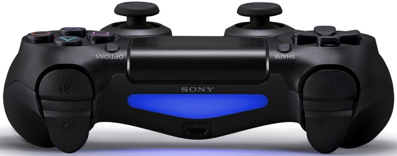

<!--
 * @Descripttion: 
 * @version: 1.1.0
 * @Copyright: Copyright (C): http://www.ookicent.com
 * @Date: 2020-08-19 09:59:07
 * @LastEditors: OOKI CENT,Ltd
 * @LastEditTime: 2020-08-19 14:04:21
-->
<p align="center">
  
</p>
<p align="center">
  <strong><a href="info/getting_started.md">Getting Started</a>| <a href="http://docs.rs/dual_shock4_controller">Documentation</a> | |  <a href="https://www.zhihu.com/people/ookicent">Blog</a> </strong>
</p>

# dual-shock4-controller

Sony DualShock 4 Controller for Rust

## Dependencies

Add this to your `Cargo.toml`:

```toml
dual-shock4-controller = "0.1.0"
```

## How To Use

```rust
    use dual_shock4_controller::joystick::{DeviceInfo,Joystick};
    
    let joystick = Joystick::new();
    let device_info = DeviceInfo{vid:0x054c,pid:0x05c4};//HID\VID_054C&PID_05C4\7&3869AC07&0&0000
    let device = joystick.connect(device_info).expect("can't find device!");//
    loop {
        let mut buf = [0u8;64];
        device.read_timeout(&mut buf[..], 1000).unwrap();
        let gamepad = joystick.get_gamepad().get_state(&buf);
        if gamepad.x_button.pressed {
            println!("× button is pressed");
            break;
        }
    }
```

## License

[license]: #license

This repository is licensed under either of

* Apache License, Version 2.0, ([LICENSE-APACHE](LICENSE-APACHE) or http://www.apache.org/licenses/LICENSE-2.0)
* MIT license ([LICENSE-MIT](LICENSE-MIT) or http://opensource.org/licenses/MIT)

at your option.

### Contribution Licensing

Unless you explicitly state otherwise, any contribution intentionally submitted for inclusion in the work by you, as defined in the Apache-2.0 license, shall be dual licensed as above, without any additional terms or conditions.
